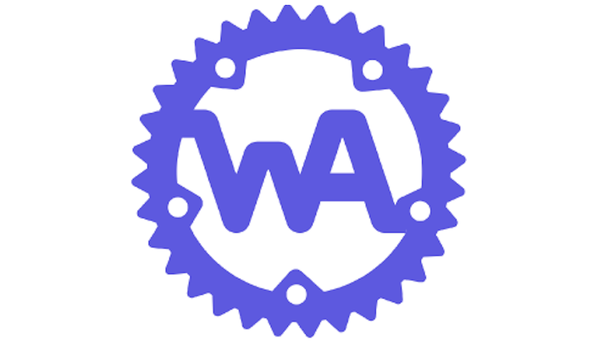

build-lists: true

---

# Why is it?

---

- In the beginning was ... JavaScript
- JITted JS, V8 (2008)
- Emscripten (2011)
- `asm.js` (2013)
- WebAssembly (announced 2015)
- browser support (2017)
- spec published (2018)

---

# What makes it _interesting_?

---

- Web-native: paranoid
- Not just the Browser: WASI, Nano-process
- Small, fast
- Portable

---

# Why Rust?

---

- WASM v1: no GC, no threads, sorry
- C → WASM?
- Rust → WASM
- Rust: open arms of `bindgen`

---

# END

---

[wasm_history]: https://www.youtube.com/watch?v=6r0NKEQqkz0
[wasm_intro]: https://www.infoq.com/presentations/webassembly-intro/
